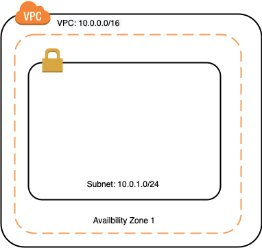
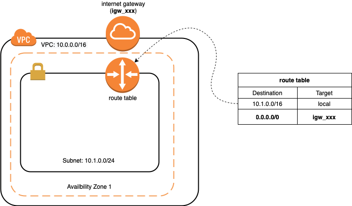
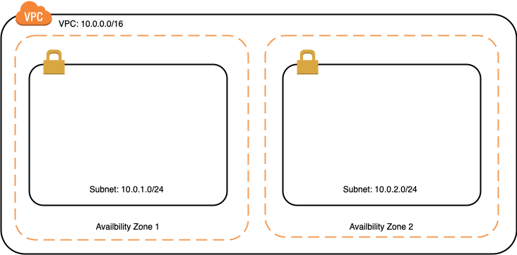
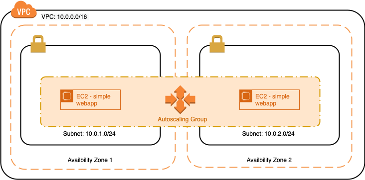
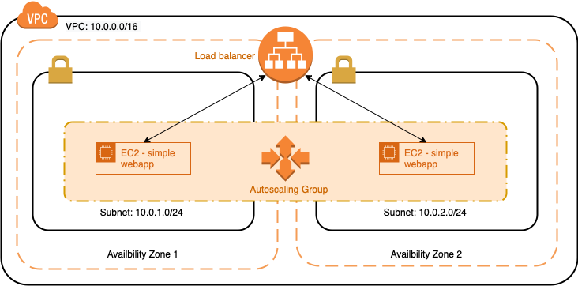

# Infrastructure as code
Deploy infrastructures on AWS using Terraform.

## Resources
**Video:** [What is Infrastructure as Code? Difference of Infrastructure as Code Tools](https://www.youtube.com/watch?v=POPP2WTJ8es)
Explains what Infrastructure as Code means. Watch the video until 5:18 (you can skip the part about the differences between the different tools)

**Tutorial:** [Introduction to Infrastructure as Code with Terraform](https://learn.hashicorp.com/tutorials/terraform/infrastructure-as-code?in=terraform/aws-get-started)
In this video an overview of how Terraform works is given.

## Tasks
### Download and configure Terraform
Terraform is a tool that helps you create and manage your cloud infrastructure from your laptop.

Install it on Windows using:
```
sudo apt-get install terraform
```
using WSL2, there's some additional steps to get access to the terraforms repository  
See: https://www.terraform.io/cli/install/apt  
  
  
or on Mac using:

```
brew install terraform
```

### Install AWS CLI
The AWS CLI is an utility for issuing various AWS API commands at the command line.

Install it on Windows using:
```
sudo apt-get install awscli
```
  
or on Mac using:

```
brew install awscli
```

### Set up AWS API credentials
Please ask your teacher for access to the sandbox AWS environment. Once you have access, go to your Learner lab -> AWS details -> AWS CLI. Copy the credential config to the `~/.aws/credentials` file on your laptop.

Check if everything is set up correctly using the `aws sts get-caller-identity` command, which should return your name and user information. Your credentials will change every time your AWS lab environment is restarted, so you'll need to copy your new credentials to the credential file each time you start working with it.

### Install the Visual Studio Code Terraform extension
Search for "HashiCorp Terraform" in the extension market and install the extension. This plugin provides auto completion and syntax highlighting.

### Follow the Terraform tutorial
**Tutorial:** [Tutorial - Build Infrastructure](https://learn.hashicorp.com/tutorials/terraform/aws-build?in=terraform/aws-get-started)
In this tutorial, you will provision an EC2 instance on Amazon Web Services (AWS).

**Tutorial:** [Tutorial - Change Infrastructure](https://learn.hashicorp.com/tutorials/terraform/aws-change?in=terraform/aws-get-started)
In this tutorial, you will modify that resource, and learn how to apply changes to your Terraform projects.

**Tutorial:** [Tutorial - Destroy Infrastructure](https://learn.hashicorp.com/tutorials/terraform/aws-destroy?in=terraform/aws-get-started)
In this tutorial, you will use Terraform to destroy this infrastructure.

In order to get a basic understanding of how Terraform works you should follow the following tutorials that explain how you can create, update and remove an EC2 instance using Terraform. Successfully executing this tutorial also means that you have set up the AWS credentials correctly.

## Assignments
### 1. Create a VPC with one public subnet
**Documentation:** [Terraform documentation - Resource: aws_vpc](https://registry.terraform.io/providers/hashicorp/aws/latest/docs/resources/vpc)
Terraform documentation on VPCs

**Documentation:** [Terraform documentation - Resource: aws_subnet](https://registry.terraform.io/providers/hashicorp/aws/latest/docs/resources/subnet)
Terraform documentation on subnets

Create an terraform configuration for the following infrastructure.



In the provided template you will find `main.tf` where you should put your code. After you have successfully deployed your infrastructure you should open the AWS console and validate whether the VPC and subnet have been created. Do this at the end of every assignment. 

### 2. Set up the routing
**Documentation:** [Terraform documentation - Resource: aws_internet_gateway](https://registry.terraform.io/providers/hashicorp/aws/latest/docs/resources/internet_gateway)
Terraform documentation on the Internet Gateway

**Documentation:** [Terraform documentation - Resource: aws_route_table](https://registry.terraform.io/providers/hashicorp/aws/latest/docs/resources/route_table)
Terraform documentation on the route table.

**Documentation:** [Terraform documentation - Resource: aws_route](https://registry.terraform.io/providers/hashicorp/aws/latest/docs/resources/route)
Terraform documentation on the route.

**Documentation:** [Terraform documentation - Resource: aws_route_table_association](https://registry.terraform.io/providers/hashicorp/aws/latest/docs/resources/route_table_association)
Terraform documentation on the route table association.

In order to correctly set up the routing in the VPC we need to have the following:
- An internet gateway to connect our VPC to the internet (and allow internet traffic to go in and out of our VPC).
- A routing table with the correct route to route traffic within the VPC and through the internet gateway.

Create an Terraform configuration for the following infrastructure.



Extend the provided template `main.tf` so that the changes are reflected in your infrastructure.

Note that you should also create a *route table association* after you have set up your route table and your route. The association should be set up between your subnet and your route table.

### 3. Launch an EC2 instance in this subnet
**Tutorial:** [Tutorial - Define Input Variables](https://learn.hashicorp.com/tutorials/terraform/aws-variables?in=terraform/aws-get-started)
Terraform configurations can include variables to make your configuration more dynamic and flexible.

**Tutorial:** [Create a bash script with templatefile](https://learn.hashicorp.com/tutorials/terraform/functions#create-a-bash-script-with-templatefile)
This tutorial explains how to provision an EC2 instance using a a bash script in a templatefile.

**Documentation:** [Terraform documentation - Resource: aws_security_group](https://registry.terraform.io/providers/hashicorp/aws/latest/docs/resources/security_group)
Terraform documentation on security groups.

Extend your terraform configuration (main.tf) so that it launches an EC2 instance in the previously created (public) subnet. You should create an instance with an `Ubuntu Server 22.04 LTS (HVM), SSD Volume Type` AMI, listed in the AWS *AMI Catalog*. On this instance you should install nginx. If successfully created the default welcome page should be shown when you navigate to the instance's ip address or DNS name.

Don't forget to create a security group for this instance. You should allow HTTP and SSH traffic to this instance.

*Note:* to access your instance you should be in possession of a PEM file for a valid key pair. You are allowed to reuse a previous key pair but if you do not have one you should manually create on in the AWS console. You should not create the key pair using Terraform!

### 4. Extend the EC2 instance
Running a web server with a default welcome page is no fun. So let's update the provisioning of the instance so that it runs our simple web app.

Your tasks:
1. Create a simple static web application. You are free to create a new simple web page or choose a previously created one.
2. Create a git repository and push your web page code to this repository.
3. Update your user data script so that the web page is pulled from the repository and stored in the proper directory so that it is correctly served by Nginx. Note that you should set your repository to public in order to pull the sources in to the EC2 instance.  

### 5. Extend your VPC with a second public subnet
**Tutorial:** [Understanding terraform count, for_each and for loop?](https://jhooq.com/terraform-for-and-for-each-loop/)
This article and video explain how the count, for_each and for loop in Terraform work.

Terraform has some useful features to create infrastructures. One of these features is the *for each* meta argument. Using the for each you can easily create multiple (similar) resources. In this objective your need to create a second subnet as shown in the figure below. Update your terraform file so that the subnets are created from a variable (stored in `variables.tf`) containing a set with the two subnets. Comment out the EC2 instance you have created in the previous assignment (so you can still get feedback from your teacher on the previous assignment). 



*Note:* Don't forget to update your route table accordingly.


### 6. Launch an autoscaling group in the subnets
**Documentation:** [Terraform documentation - Resource: aws_autoscaling_group](https://registry.terraform.io/providers/hashicorp/aws/latest/docs/resources/autoscaling_group)
Terraform documentation on Autoscaling

Extend the terraform template to create an auto scaling group to launch new instances. The auto scaling group should have a minimum size of 2, a desired size of 2 and a maximum size of 4. Use the user data to clone [this](https://gitlab.com/sealy/simple-webapp) git repository and install and run the simple web app (also know from the previous assignment). As a scaling policy you should set the "CPU load". Give it a very low threshold value so that the scale out is easily triggered.

Your final infrastructure should look like this:



*Note:* If you run into trouble configuring the terraform template, try to create the autoscaling group using the AWS console first.

### 7. Load balance your instances
**Documentation:** [Terraform documentation - Resource: aws_lb](https://registry.terraform.io/providers/hashicorp/aws/latest/docs/resources/lb)
Terraform documentation on the Load Balancer

For the final objective you should create a load balancer to load balance the instances in the autoscaling group. Your final infrastructure should look like this:



### 8. Destroy your infrastructure
Once you have a working infrastructure you should clean it up so that you do not waste resources in AWS. In order to validate that everything is working correctly you can deploy a clean version of your infrastructure afterwards. If your configuration is correct your infrastructure should be created without issues. Just be sure te remove everything again afterwards. 
